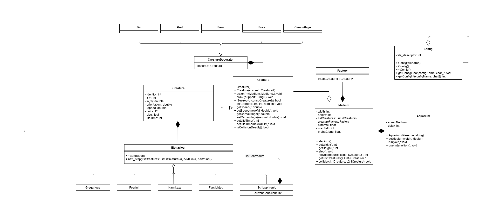
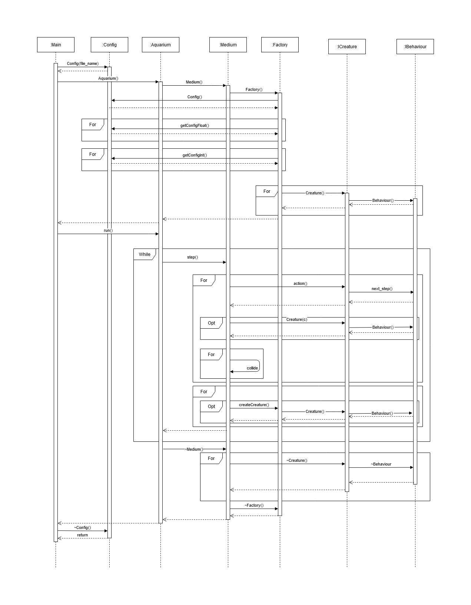

# Creature Simulation

This repository contain the source code of the final project for the C++ courses.

## Context of the project

The project is part of the C++ courses given at [IMT Atlantique](https://www.imt-atlantique.fr/en)

## Modelisation

Some UML were realised during the modelisation phase of the project.In this
modelisation we took advantage of the design patterns we learned during the lecture.

  
  <i>Class diagram</i>

  
  <i>Sequence diagram</i>

