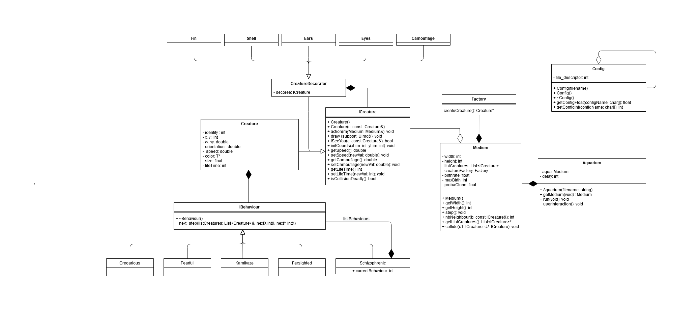
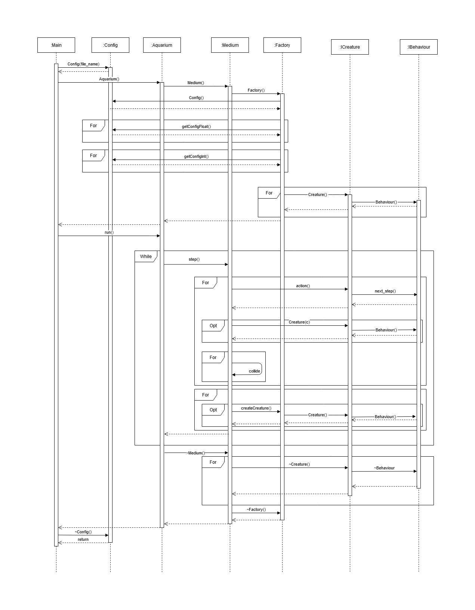

# Creature Simulation

This repository contain the source code of the final project for the C++ courses.

[![Contributors][contributors-shield]][contributors-url]
[![Forks][forks-shield]][forks-url]
[![Stargazers][stars-shield]][stars-url]
[![Issues][issues-shield]][issues-url]

## Context of the project

The project is part of the C++ courses given at [IMT Atlantique](https://www.imt-atlantique.fr/en)

## Repository structure

    .
    ├── legacy                  # the code given as starting point of the project
    ├── uml                     # UML and modelisation files
    ├── src                     # Source files
    ├── test                    # Automated tests
    └── README.md

## Modelisation

Some UML were realised during the modelisation phase of the project.In this
modelisation we took advantage of the design patterns we learned during the lecture.

  
  <i>Class diagram</i>

  
  <i>Sequence diagram</i>

